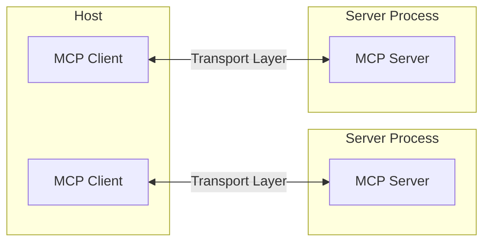

# Building MCP with LLMs - Technical Guide

## MCP Clients Overview

MCP (Model Context Protocol) is supported by a growing ecosystem of AI applications. Here's a condensed overview of key clients and their capabilities.

### Feature Support Matrix

Key features across MCP clients:
- **Resources**: File/data access
- **Prompts**: Reusable prompt templates  
- **Tools**: Execute functions and commands
- **Discovery**: Dynamic tool discovery
- **Sampling**: Request LLM completions

### Major Clients

**Claude Desktop & Claude Code**
- Full support for resources, prompts, and tools
- Local and remote MCP server connections
- No MCP support in Claude.ai web version

**VS Code GitHub Copilot**
- Tools support with dynamic discovery
- Secure configuration and debugging features
- Per-session tool selection

**Cursor & Windsurf**
- Tools support for AI-assisted coding
- Integration with development workflows

**Continue & Cline**
- Open-source AI code assistants
- Full MCP feature support
- Natural language tool creation

**Slack/Discord/WhatsApp Clients**
- Tools support for messaging platforms
- OAuth integration capabilities
- Remote server connections

### Development & Frameworks

**FastMCP (Python)**: Rapid MCP server development with decorators
**Genkit**: Cross-language SDK with MCP plugin support
**Spring AI (Java)**: Official Java SDK for MCP
**Kotlin SDK**: JetBrains-developed SDK

## Core Architecture

### Technical Requirements

MCP follows a client-server architecture with these components:



### Protocol Layer Details

The protocol layer handles:
- Message framing and request/response linking
- High-level communication patterns
- Error propagation and handling

**TypeScript Implementation:**
```typescript
class Protocol<Request, Notification, Result> {
    // Handle incoming requests
    setRequestHandler<T>(schema: T, handler: (request: T, extra: RequestHandlerExtra) => Promise<Result>): void
    
    // Handle incoming notifications
    setNotificationHandler<T>(schema: T, handler: (notification: T) => Promise<void>): void
    
    // Send requests and await responses
    request<T>(request: Request, schema: T, options?: RequestOptions): Promise<T>
    
    // Send one-way notifications
    notification(notification: Notification): Promise<void>
}
```

**Python Implementation:**
```python
class Session(BaseSession[RequestT, NotificationT, ResultT]):
    async def send_request(self, request: RequestT, result_type: type[Result]) -> Result:
        """Send request and wait for response. Raises McpError if response contains error."""
        
    async def send_notification(self, notification: NotificationT) -> None:
        """Send one-way notification that doesn't expect response."""
```

### Transport Mechanisms

1. **Stdio Transport**
   - Uses standard input/output streams
   - Ideal for local process communication
   - Low latency, high throughput
   - Process lifecycle management

2. **HTTP with SSE Transport**
   - Server-Sent Events for server-to-client messages
   - HTTP POST for client-to-server messages
   - Supports authentication headers
   - Cross-network communication

### Message Types (JSON-RPC 2.0)

**Request Format:**
```typescript
interface Request {
    jsonrpc: "2.0";
    id: string | number;
    method: string;
    params?: { [key: string]: any };
}
```

**Response Format:**
```typescript
interface Response {
    jsonrpc: "2.0";
    id: string | number;
    result?: any;
    error?: {
        code: number;
        message: string;
        data?: any;
    };
}
```

**Notification Format:**
```typescript
interface Notification {
    jsonrpc: "2.0";
    method: string;
    params?: { [key: string]: any };
}
```

### Connection Lifecycle

1. **Initialization Sequence:**
   ```mermaid
   sequenceDiagram
       participant Client
       participant Server
       
       Client->>Server: initialize request
       Server->>Client: initialize response
       Client->>Server: initialized notification
       
       Note over Client,Server: Connection ready for use
   ```

2. **Capability Negotiation:**
   ```json
   {
     "method": "initialize",
     "params": {
       "protocolVersion": "2024-12-05",
       "capabilities": {
         "roots": { "listChanged": true },
         "sampling": {}
       },
       "clientInfo": {
         "name": "claude-desktop",
         "version": "1.0.0"
       }
     }
   }
   ```

### Error Handling

Standard error codes:
```typescript
enum ErrorCode {
    ParseError = -32700,
    InvalidRequest = -32600,
    MethodNotFound = -32601,
    InvalidParams = -32602,
    InternalError = -32603
}
```

Custom error codes should be > -32000.

## Resources - Technical Implementation

### Overview
Resources are **application-controlled** primitives that expose data and content. Different clients handle resources differently:
- Claude Desktop requires explicit user selection
- Other clients may auto-select based on heuristics
- Some allow the AI model to determine resource usage

### Resource Structure

**URI Format:**
```
[protocol]://[host]/[path]
```

Examples:
- `file:///home/user/documents/report.pdf`
- `postgres://database/customers/schema`
- `screen://localhost/display1`

**Resource Types:**

1. **Text Resources** (UTF-8 encoded):
   - Source code, config files, logs
   - JSON/XML data, plain text

2. **Binary Resources** (base64 encoded):
   - Images, PDFs, audio/video files
   - Other non-text formats

### Discovery Mechanisms

**Direct Resources:**
```typescript
{
  uri: string;           // Unique identifier
  name: string;          // Human-readable name
  description?: string;  // Optional description
  mimeType?: string;     // Optional MIME type
}
```

**Resource Templates (RFC 6570):**
```typescript
{
  uriTemplate: string;   // Dynamic URI template
  name: string;          
  description?: string;  
  mimeType?: string;     
}
```

### Reading Resources

**Request:**
```json
{
  "method": "resources/read",
  "params": {
    "uri": "file:///logs/app.log"
  }
}
```

**Response:**
```json
{
  "contents": [{
    "uri": "file:///logs/app.log",
    "mimeType": "text/plain",
    "text": "Log content here..."
  }]
}
```

### Real-time Updates

1. **List Changes**: `notifications/resources/list_changed`
2. **Content Updates**:
   - Subscribe: `resources/subscribe`
   - Update notification: `notifications/resources/updated`
   - Unsubscribe: `resources/unsubscribe`

## Tools - Technical Implementation

### Overview
Tools are **model-controlled** primitives that enable function execution. They're automatically exposed to the LLM for autonomous use.

### Tool Definition Structure

```typescript
interface Tool {
  name: string;
  description: string;
  inputSchema: {
    type: "object";
    properties: {
      [key: string]: JSONSchema;
    };
    required?: string[];
  };
}
```

### Implementation Example

**TypeScript:**
```typescript
server.setRequestHandler(CallToolRequestSchema, async (request) => {
  const { name, arguments: args } = request.params;
  
  switch (name) {
    case "search_files":
      return {
        content: [{
          type: "text",
          text: await searchFiles(args.query, args.path)
        }]
      };
    default:
      throw new Error(`Unknown tool: ${name}`);
  }
});
```

**Python with FastMCP:**
```python
@app.tool()
async def search_files(query: str, path: str = ".") -> str:
    """Search for files containing the query string."""
    results = await perform_search(query, path)
    return format_results(results)
```

### Progress Reporting

For long-running operations:
```typescript
{
  progressToken: string;
  progress: number;      // 0-100 or incremental
  total?: number;        // Optional total units
}
```

### Tool Discovery

Clients discover tools via `tools/list`:
```json
{
  "tools": [{
    "name": "search_files",
    "description": "Search for files by content",
    "inputSchema": {
      "type": "object",
      "properties": {
        "query": { "type": "string" },
        "path": { "type": "string", "default": "." }
      },
      "required": ["query"]
    }
  }]
}
```

## Prompts - Technical Implementation

### Overview
Prompts are **user-controlled** templates for standardized LLM interactions. They're exposed as UI elements like slash commands.

### Prompt Structure

```typescript
interface Prompt {
  name: string;              
  description?: string;      
  arguments?: [{              
    name: string;          
    description?: string;  
    required?: boolean;    
  }]
}
```

### Dynamic Prompt Generation

**With Embedded Resources:**
```typescript
server.setRequestHandler(GetPromptRequestSchema, async (request) => {
  const { name, arguments: args } = request.params;
  
  if (name === "analyze-logs") {
    const logs = await fetchLogs(args.timeframe);
    const code = await readFile(args.fileUri);
    
    return {
      messages: [
        {
          role: "user",
          content: {
            type: "text",
            text: "Analyze these logs for issues:"
          }
        },
        {
          role: "user",
          content: {
            type: "resource",
            resource: {
              uri: "logs://recent",
              text: logs,
              mimeType: "text/plain"
            }
          }
        },
        {
          role: "user",
          content: {
            type: "resource",
            resource: {
              uri: args.fileUri,
              text: code,
              mimeType: "text/x-python"
            }
          }
        }
      ]
    };
  }
});
```

### Multi-step Workflows

```typescript
const debugWorkflow = {
  name: "debug-error",
  async getMessages(error: string) {
    return [
      {
        role: "user",
        content: {
          type: "text",
          text: `Error: ${error}`
        }
      },
      {
        role: "assistant",
        content: {
          type: "text",
          text: "I'll help debug this. What have you tried?"
        }
      }
    ];
  }
};
```

## Sampling - Technical Implementation

### Overview
Sampling allows servers to request LLM completions through the client with human-in-the-loop control.

### Request Structure

```typescript
interface SamplingRequest {
  messages: Message[];
  modelPreferences?: {
    hints?: [{ name?: string }];
    costPriority?: number;         // 0-1
    speedPriority?: number;        // 0-1
    intelligencePriority?: number; // 0-1
  };
  systemPrompt?: string;
  includeContext?: "none" | "thisServer" | "allServers";
  temperature?: number;
  maxTokens: number;
  stopSequences?: string[];
  metadata?: Record<string, unknown>;
}
```

### Example Request

```json
{
  "method": "sampling/createMessage",
  "params": {
    "messages": [{
      "role": "user",
      "content": {
        "type": "text",
        "text": "Analyze this code for bugs"
      }
    }],
    "modelPreferences": {
      "hints": [{ "name": "claude-3-sonnet" }],
      "intelligencePriority": 0.8
    },
    "includeContext": "thisServer",
    "maxTokens": 1000
  }
}
```

## Complete Implementation Example

### Full MCP Server with Resources, Tools, and Prompts

**Python with FastMCP:**
```python
from mcp.server import Server
from mcp.server.stdio import stdio_server
import mcp.types as types
from datetime import datetime
import json

app = Server("workout-analytics-server")

# Mock data store
WORKOUTS = []

# Resources
@app.list_resources()
async def list_resources() -> list[types.Resource]:
    return [
        types.Resource(
            uri="workout://history",
            name="Workout History",
            description="Complete workout history with TSS data",
            mimeType="application/json"
        ),
        types.Resource(
            uri="workout://metrics/latest",
            name="Latest Fitness Metrics",
            description="Current CTL, ATL, and TSB values",
            mimeType="application/json"
        )
    ]

@app.read_resource()
async def read_resource(uri: str) -> str:
    if uri == "workout://history":
        return json.dumps(WORKOUTS, indent=2)
    elif uri == "workout://metrics/latest":
        metrics = calculate_metrics(datetime.now())
        return json.dumps(metrics, indent=2)
    raise ValueError(f"Resource not found: {uri}")

# Tools
@app.tool()
async def get_workouts(
    start_date: str = None, 
    end_date: str = None,
    limit: int = 50
) -> list[dict]:
    """Retrieve workout history with optional date filtering."""
    filtered = WORKOUTS
    
    if start_date:
        filtered = [w for w in filtered if w["date"] >= start_date]
    if end_date:
        filtered = [w for w in filtered if w["date"] <= end_date]
    
    return filtered[:limit]

@app.tool()
async def calculate_fitness_metrics(target_date: str) -> dict:
    """Calculate CTL, ATL, and TSB for a specific date."""
    date = datetime.fromisoformat(target_date)
    return calculate_metrics(date)

@app.tool()
async def analyze_performance(
    days: int = 30,
    metric: str = "tss"
) -> dict:
    """Analyze performance trends over specified period."""
    # Implementation of performance analysis
    recent_workouts = [w for w in WORKOUTS[-days:]]
    
    if metric == "tss":
        avg_tss = sum(w["tss"] for w in recent_workouts) / len(recent_workouts)
        trend = "increasing" if recent_workouts[-1]["tss"] > avg_tss else "decreasing"
        
        return {
            "period_days": days,
            "average_tss": avg_tss,
            "trend": trend,
            "recommendation": get_training_recommendation(avg_tss, trend)
        }

# Prompts
@app.list_prompts()
async def list_prompts() -> list[types.Prompt]:
    return [
        types.Prompt(
            name="weekly-summary",
            description="Generate a weekly training summary",
            arguments=[
                types.PromptArgument(
                    name="week_start",
                    description="Start date of the week (YYYY-MM-DD)",
                    required=True
                )
            ]
        ),
        types.Prompt(
            name="race-readiness",
            description="Assess readiness for an upcoming race",
            arguments=[
                types.PromptArgument(
                    name="race_date",
                    description="Target race date",
                    required=True
                ),
                types.PromptArgument(
                    name="race_type",
                    description="Type of race (sprint, olympic, etc.)",
                    required=False
                )
            ]
        )
    ]

@app.get_prompt()
async def get_prompt(name: str, arguments: dict = None) -> types.GetPromptResult:
    if name == "weekly-summary":
        week_data = await get_workouts(
            start_date=arguments["week_start"],
            end_date=add_days(arguments["week_start"], 7)
        )
        
        return types.GetPromptResult(
            messages=[
                types.PromptMessage(
                    role="user",
                    content=types.TextContent(
                        type="text",
                        text=f"Please analyze this week's training data and provide insights:\n\n{json.dumps(week_data, indent=2)}"
                    )
                )
            ]
        )
    
    elif name == "race-readiness":
        metrics = await calculate_fitness_metrics(arguments["race_date"])
        recent_workouts = await get_workouts(limit=14)
        
        return types.GetPromptResult(
            messages=[
                types.PromptMessage(
                    role="user",
                    content=types.TextContent(
                        type="text",
                        text=f"Assess my readiness for a {arguments.get('race_type', 'race')} on {arguments['race_date']}. Current metrics: {metrics}. Recent training: {recent_workouts}"
                    )
                )
            ]
        )
    
    raise ValueError(f"Unknown prompt: {name}")

# Helper functions
def calculate_metrics(date: datetime) -> dict:
    """Calculate CTL, ATL, and TSB using exponentially weighted averages."""
    ctl_days = 42
    atl_days = 7
    
    # Simplified calculation for example
    relevant_workouts = [w for w in WORKOUTS if w["date"] <= date.isoformat()]
    
    if not relevant_workouts:
        return {"ctl": 0, "atl": 0, "tsb": 0}
    
    # Calculate exponentially weighted averages
    ctl = calculate_ewa(relevant_workouts, ctl_days)
    atl = calculate_ewa(relevant_workouts, atl_days)
    tsb = ctl - atl
    
    return {
        "date": date.isoformat(),
        "ctl": round(ctl, 1),
        "atl": round(atl, 1),
        "tsb": round(tsb, 1),
        "form": "good" if tsb > 0 else "fatigued"
    }

# Server initialization
async def main():
    # Load mock data
    global WORKOUTS
    WORKOUTS = generate_mock_workouts()
    
    # Start server
    async with stdio_server() as streams:
        await app.run(
            streams[0],
            streams[1],
            app.create_initialization_options()
        )

if __name__ == "__main__":
    import asyncio
    asyncio.run(main())
```

**TypeScript Implementation Structure:**
```typescript
import { Server } from "@modelcontextprotocol/sdk/server/index.js";
import { StdioServerTransport } from "@modelcontextprotocol/sdk/server/stdio.js";
import {
  CallToolRequestSchema,
  ListResourcesRequestSchema,
  ReadResourceRequestSchema,
  ListPromptsRequestSchema,
  GetPromptRequestSchema,
} from "@modelcontextprotocol/sdk/types.js";

const server = new Server(
  {
    name: "workout-analytics-server",
    version: "1.0.0",
  },
  {
    capabilities: {
      resources: {},
      tools: {},
      prompts: {},
    },
  }
);

// Implement handlers...
await server.connect(new StdioServerTransport());
```

## Best Practices Summary

### Security
- **Input Validation**: Always validate and sanitize inputs
- **Access Control**: Implement proper authentication/authorization
- **Transport Security**: Use TLS for remote connections
- **Error Handling**: Don't leak sensitive information in errors

### Performance
- **Caching**: Cache frequently accessed resources
- **Pagination**: Implement for large datasets
- **Progress Reporting**: Use for long-running operations
- **Timeouts**: Set appropriate timeouts for all operations

### Developer Experience
- **Clear Naming**: Use descriptive names for tools/resources
- **Documentation**: Provide detailed descriptions
- **Error Messages**: Make errors actionable
- **Type Safety**: Use schemas for validation

### Testing
- **Unit Tests**: Test individual handlers
- **Integration Tests**: Test with real MCP clients
- **Error Cases**: Test error handling paths
- **Performance Tests**: Validate under load

## Deployment Considerations

### Local Deployment
```json
{
  "mcpServers": {
    "workout-server": {
      "command": "python",
      "args": ["-m", "workout_mcp_server"],
      "env": {
        "WORKOUT_DATA_PATH": "/path/to/data"
      }
    }
  }
}
```

### Remote Deployment (SSE)
- Deploy behind reverse proxy (nginx/Apache)
- Implement authentication middleware
- Use environment variables for configuration
- Monitor server health and performance

## Resources

- [MCP Specification](https://spec.modelcontextprotocol.io)
- [Python SDK & FastMCP](https://github.com/modelcontextprotocol/python-sdk)
- [TypeScript SDK](https://github.com/modelcontextprotocol/typescript-sdk)
- [Official Examples](https://github.com/modelcontextprotocol/servers)
- [Community Discussions](https://github.com/orgs/modelcontextprotocol/discussions)